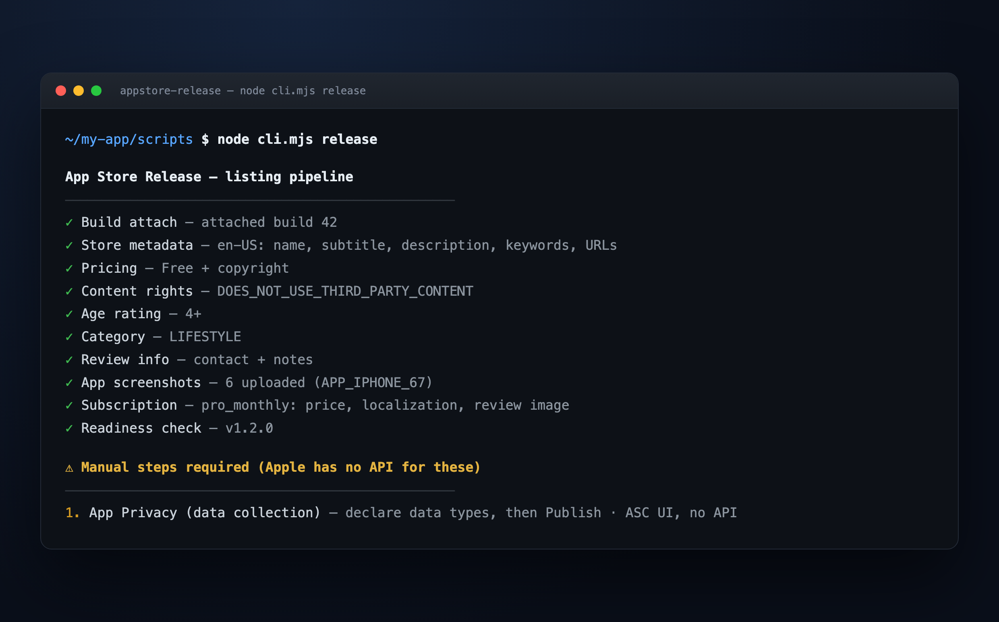

# appstore-release

[](LICENSE)
[](https://www.npmjs.com/package/appstore-release)
[](https://modelcontextprotocol.io)
[](https://code.claude.com/docs/en/plugin-marketplaces)

**Ship an iOS app to App Store review — end to end, over the App Store Connect API.**

A CLI and an MCP server that turn the tedious, error-prone parts of an App Store submission into one repeatable, idempotent pipeline. You fill in a `config.json` once; it attaches the build, writes the metadata, uploads the screenshots, sets pricing, age rating, content rights and review info, configures subscriptions, and submits for review.

It stops for the **two things Apple genuinely does not expose via API** — and hands you the exact clicks for those.



---

## This is not another App Store Connect API wrapper

There are several MCP servers that expose the App Store Connect API, some advertising over a thousand tools. Raw endpoint coverage is not the scarce thing.

An agent that can call `PATCH /v1/appStoreVersionLocalizations/{id}` still does not know that:

- `whatsNew` returns **409 STATE_ERROR** on a first version,
- an emoji in the description is a hard **409 ATTRIBUTE.INVALID.INVALID_CHARACTERS**,
- the age-rating declaration lives on `appInfos` (not the version) and needs all 21 attributes including `ageAssurance`, or it 409s,
- a screenshot that skips its commit step stays invisible forever with nothing in the UI to explain why,
- and a first subscription simply **cannot** be attached to a version through the API at all.

Endpoint coverage hands the model the landmines. This tool defuses them. It ships **11 tools**, and the important one answers the only question that matters:

```
$ appstore-release check

Readiness — Wellness · v1.0 (PREPARE_FOR_SUBMISSION)
──────────────────────────────────────────────────────────
BLOCKED — there is still work this tool can do

✓ Version and build
✗ Pricing, category and ratings
✓ Store metadata
✗ Screenshots
· Subscriptions
✗ Review and submission

Next, in order
──────────────────────────────────────────────────────────
1. Run appstore-release pricing
   $ appstore-release pricing
2. Run appstore-release screenshots
   $ appstore-release screenshots
3. Declare the data types matching the app's privacy manifest, then press Publish.
   App Store Connect → your app → App Privacy → Get Started / Edit → Publish
```

Every finding carries who can fix it. `uiOnly: true` means Apple has no API and never will; `fixOwner: "ui"` without it means we could automate it and have not yet. Those are never conflated — there is a test that enforces it.

## Install

**As an MCP server** — for Claude Code, Claude Desktop, Cursor, Zed, or anything that speaks MCP:

```jsonc
{
  "mcpServers": {
    "appstore-release": {
      "command": "npx",
      "args": ["-y", "appstore-release", "mcp"],
      "env": {
        "ASC_KEY_ID": "ABCDE12345",
        "ASC_ISSUER_ID": "69a6de00-…",
        "ASC_P8_PATH": "/abs/AuthKey_ABCDE12345.p8",
        "ASC_APP_ID": "1234567890",
      },
    },
  },
}
```

**As a CLI** — for any agent that can run a shell command, and for CI:

```bash
npm i -g appstore-release      # or just npx appstore-release <command>
```

**As a Claude Code plugin** (brings the skill and the MCP server together):

```
/plugin marketplace add beydemirfurkan/appstore-release
/plugin install appstore-release@beydemirfurkan
```

## Quick start

1. **Create an App Store Connect API key** — Users and Access → Integrations → App Store Connect API, role **App Manager**. Download the `.p8`; note the Key ID and Issuer ID. ([setup.md](skills/appstore-release/references/setup.md))
2. **Scaffold and fill a config:**

   ```bash
   appstore-release init          # writes appstore.config.json with a $schema for autocomplete
   ```

3. **Point it at your app and check:**

   ```bash
   export ASC_KEY_ID=ABCDE12345
   export ASC_ISSUER_ID=69a6de00-…
   export ASC_P8_PATH=/abs/AuthKey_ABCDE12345.p8   # or ASC_P8 with the key inline
   export ASC_APP_ID=1234567890                    # the digits in the App Store Connect URL

   appstore-release doctor        # credentials, tools and config — touches no app data
   appstore-release check         # what is missing, in the order to fix it
   appstore-release release --dry-run    # exactly what would change, sending nothing
   appstore-release release       # apply it (idempotent — safe to re-run)
   appstore-release submit --submit
   ```

Or just tell your agent _"publish my app for review"_.

## Commands

| Command                    | What it does                                                                       |
| -------------------------- | ---------------------------------------------------------------------------------- |
| `init` `schema` `validate` | scaffold a config, print its JSON Schema, check it offline — no credentials needed |
| `doctor`                   | verify credentials, `openssl`, Node and config without touching app data           |
| `status`                   | full read-only inventory                                                           |
| `check`                    | readiness report: findings, verdict, ordered next actions                          |
| `release`                  | the whole listing pipeline, then a check                                           |
| `attach-build`             | attach the newest VALID build (or `--build <version>`)                             |
| `metadata`                 | name, subtitle, description, keywords, promo, support/marketing/privacy URLs       |
| `pricing`                  | price schedule + copyright                                                         |
| `content-rights`           | third-party content declaration                                                    |
| `age-rating`               | the full 2025 age-rating declaration                                               |
| `category`                 | primary/secondary category                                                         |
| `review-info`              | App Review contact + demo account                                                  |
| `screenshots`              | diff-then-upload exact-size PNGs                                                   |
| `subscription`             | localizations, price, paywall review image                                         |
| `submit --submit`          | submit for review — refuses unless the readiness verdict is `ready`                |
| `credentials`              | distribution certificate + provisioning profile (fixes stale EAS credentials)      |
| `mcp`                      | run the MCP server on stdio                                                        |

Global flags: `--json` (one JSON document on stdout, human text on stderr), `--dry-run`, `--config`, `--project-root`, `--app-id`, `--verbose`, `--exit-zero`.

**Exit codes** are the point of the design: `0` ok · `2` usage · `3` config/credentials · `4` blocked but fixable · `5` only a human in App Store Connect can finish. That last distinction is what makes `appstore-release check && appstore-release submit --submit` safe in CI.

## MCP tools

| Tool                         | Read-only | Purpose                                                  |
| ---------------------------- | --------- | -------------------------------------------------------- |
| `asc_readiness_report`       | ✓         | verdict, findings, ordered next actions — **start here** |
| `asc_app_overview`           | ✓         | inventory of the app's current state                     |
| `asc_list_apps`              | ✓         | find the numeric app id from a name or bundle id         |
| `asc_validate_config`        | ✓         | check a config; no network, no credentials               |
| `asc_plan_release`           | ✓         | dry-run the pipeline and return the diff                 |
| `asc_apply_release`          |           | write the listing                                        |
| `asc_upload_screenshots`     |           | diff-then-upload                                         |
| `asc_configure_subscription` |           | localizations, price, review screenshot                  |
| `asc_submit_for_review`      |           | irreversible; refuses unless ready                       |
| `asc_generate_credentials`   |           | off unless the operator opts in                          |

Resources: `appstore-release://gotchas`, `://runbook`, `://config-schema`, `://config-template`, `://references/screenshots`, `://references/setup`.

Every mutating tool requires an explicit `confirm: true`, which forces a two-turn handshake the host shows the user. `asc_submit_for_review` computes the readiness report first and declines when anything is blocking — a guardrail a generic API wrapper structurally cannot offer, because it does not know what "ready" means.

## The two UI-only steps

Apple exposes no API for either. `check` detects both and prints the exact clicks.

1. **App Privacy → Data Collection** — every `appDataUsages*` endpoint 404s. Declare the data types, then Publish.
2. **A first subscription** — `reviewSubmissionItems` has no `subscription` relationship. Attach it to the version and submit in the UI. Subsequent subscriptions work through the API.

## Safety

- **Idempotent.** Re-running when everything already matches sends nothing. Screenshots diff against the checksum App Store Connect stores; metadata writes only what differs.
- **`--dry-run` is enforced at the HTTP client**, not per operation, so it cannot be forgotten. A test asserts zero writes across all 12 mutating operations.
- **Credentials never enter tool arguments.** Tool arguments are model-visible and reach transcripts and host logs; a leaked `.p8` cannot be rotated without breaking every other integration. They come from the environment only, and a test asserts no tool accepts one.
- **Certificate slots are not spent silently.** Apple caps an account at three distribution certificates; `credentials` reuses one whose key you already hold and refuses the last slot without `--allow-new-cert`.
- Secrets are written `0600` into a `0700` directory, and `git check-ignore` is consulted so an unignored secret is reported.

## Architecture

```
src/
  cli.mjs      dispatcher · cli/     args, rendering, doctor, offline commands
  index.mjs    library API: createContext, runOperation, runPipeline, listOperations
  core/        context (composition root) · credentials · config · schema · findings · paths · events
  asc/         client (retry, pagination, dry-run) · jwt · discovery · assets · png
  ops/         one file per task, uniform { meta, run(ctx, args) } contract
  report/      snapshot → checks/ → report → three renderers
  mcp/         server, tools, resources
```

The library API is the same one the CLI and the MCP server use, so the surfaces cannot drift:

```js
import { createContext, getReadinessReport, runPipeline } from "appstore-release";

const ctx = await createContext({
  credentials: { keyId, issuerId, privateKey, appId },
  config: "./appstore.config.json",
  dryRun: true,
});
const report = await getReadinessReport(ctx);
if (report.verdict === "ready") await runPipeline(undefined, ctx);
```

Add a capability by dropping a file in `src/ops/` and registering it in `src/ops/registry.mjs`. See [`_contract.md`](src/ops/_contract.md).

## Requirements

- Node.js 20.11+ (built-in `fetch` and `crypto`; two dependencies, both for the MCP server).
- `openssl` — only for the `credentials` command.
- An iOS app already uploaded to App Store Connect. The build step assumes Expo/EAS; everything else works for any iOS app.

## Contributing

Issues and PRs welcome — especially new gotchas, new checks, and the roadmap items: multi-locale metadata, multiple screenshot display types, paid price tiers, arbitrary age ratings, version creation, phased release. Keep operations idempotent and config-driven per the contract, and add a test.

## License

[MIT](LICENSE) © 2026 Furkan Beydemir

> Not affiliated with or endorsed by Apple. "App Store" and "App Store Connect" are trademarks of Apple Inc.
